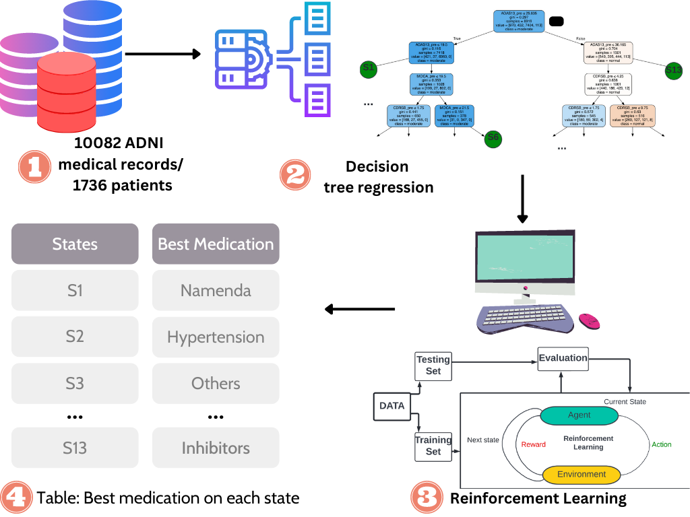

<table border='1' align="center">
<tr>

</tr>
</tabe>

# Objective:

We propose a study to leverage reinforcement learning (RL) to learn the clinicians’ decisions for AD patients based on the longitude records from Electronic Health Records (EHR).

# Data: 

The data for this study can be found at Alzheimer's Disease Neuroimaging Initiative (ADNI) database (adni.loni.usc.edu). We combined lab test data and medication data to get our final dataset. 

# How to use:

- First download dataset named [AD Challenge Training Data: Clinical (Updated)](https://ida.loni.usc.edu/pages/access/studyData.jsp?categoryId=43&subCategoryId=94) and [Concurrent Medications Log [ADNI1,GO,2,3]](https://ida.loni.usc.edu/pages/access/studyData.jsp?categoryId=15&subCategoryId=40) from ADNI database.
- Download this repo and install all the requirements from requirements.txt.
- Go to "codes > whole-data > data" folder and run combined.py, then d_tree.py, then final_merge.py. This prepares the data for our algorithms (You need to change the datapath in your code"
- Go to "codes > whole-data > algorithms" folder and run original_main.py.
- You can repeat this for all the data cohort. 

# Python version

Python 3.11.1

# Contact 

For help or questions of using the application, please contact Zong.nansu@mayo.edu

